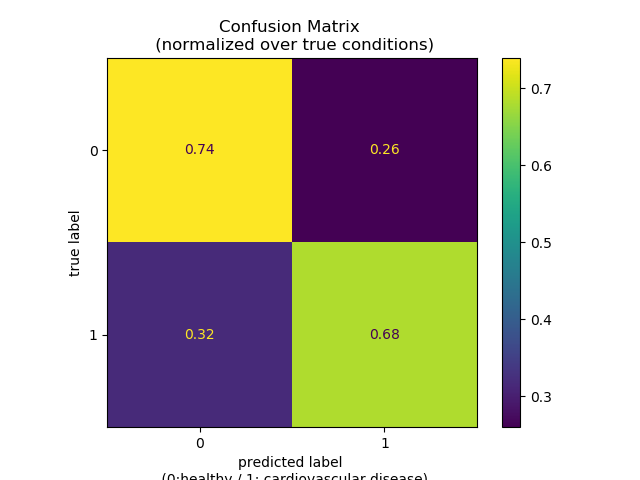
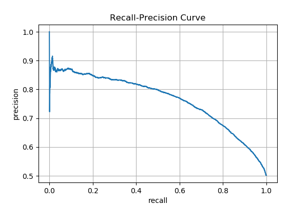

# Predicting Cardiovascular Disease using AWS Sagemaker

## Project Overview
The purpose of this project is to predict cardiovascular disease in aws using sagemaker studio. This feasibility study is structured in the following order:
- Exploratory data analysis
- Model development using sklearn´s open-source linear model
- Model development using Sagemaker´s build-in linear model
- Model Deployment
- Model Evaluation

## Running the JupyterNotebook
- create an IAM user with adequate permissions
- open the notebook in Sagemaker Studio
- select image "Data Science"
- select kernel: Python 3

## Exploratory Data Analysis
- see Jupyter Notebook

## Model Development
- see Jupyter Notebook

## Model Evaluation

The confusion matrix shows the percentages of the predicted labels with reference to the ground truth (0: healthy; 1: cardiovascular disease) using the linear built-in linear model by Sagemaker. The model correctly classifies 75% of all healthy subjects as healthy while 25% are being misclassified as unhealthy. The model further classifies 69% of all unhealthy subjects as unhealthy while 31% are misclassified as being healthy. The overall accuracy score of the model is 72%. Using a decision threshold of 0.5 leads to a recall score of 69%, a precision score of 73% and thus a f1 score of 71%. The roc-auc score is 78%.  

Having a closer look at the trade-off between recall and precision shows that for example if the model is calibrated to detect 80% (recall) of all subjects with cardiovascular disease, then the precision is nearly 70% meaning 30% of all predictions are incorrect.  

In conclusion, the mode is quite robust but however could probably be improved by applying also non-linear classifiers such as xgboost or neural networks.